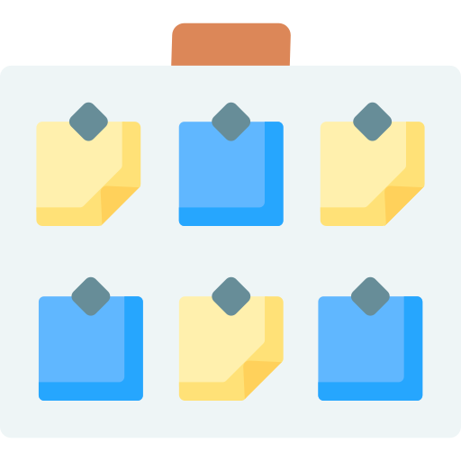

# 	Juego Tic-Tac_Toe, 3 en raya

> [!IMPORTANT]
> El proyecto <b>3 en raya</b> en Python se crea representando el tablero como una lista, mostrando su estado en consola, alternando turnos entre jugadores, solicitando movimientos válidos, comprobando tras cada jugada si hay ganador o empate mediante combinaciones ganadoras predefinidas, y repitiendo este ciclo en un bucle hasta que el juego termine.

> Este proyecto normalmente se hace como una aplicación de consola, y se estructura en:
-  · Representación del tablero
-  · Mostrar el tablero
-  · Pedir movimientos al jugador
-  · Comprobar si alguien ha ganado o hay empate
-  · Controlar el turno de los jugadores
-  · Bucle principal de juego

<picture>
  <source media="(prefers-color-scheme: dark)" srcset="images/xss1.png">
  <source media="(prefers-color-scheme: light)" srcset="images/xss1.png">
  
</picture>

