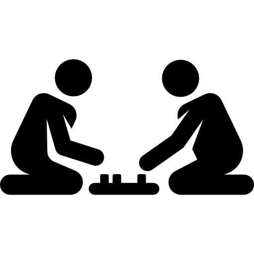

# 	Juego Tic-Tac_Toe, 3 en raya

> [!IMPORTANT]
> El proyecto <b>3 en raya</b> en Python se crea representando el tablero como una lista, mostrando su estado en consola, alternando turnos entre jugadores, solicitando movimientos válidos, comprobando tras cada jugada si hay ganador o empate mediante combinaciones ganadoras predefinidas, y repitiendo este ciclo en un bucle hasta que el juego termine.

> Este proyecto normalmente se hace como una aplicación de consola, y se estructura en:
-  Representación del tablero
-  Mostrar el tablero
-  Pedir movimientos al jugador
-  Comprobar si alguien ha ganado o hay empate
-  Controlar el turno de los jugadores
-  Bucle principal de juego

> Conceptos repasados en este juego: 
- 1. Listas: 
  - Para representar el tablero como una lista de 9 elementos.
  - Manipulación de elementos por índice.

- 2. Funciones:
  - Para dividir el código en bloques reutilizables como mostrar_tablero(), comprobar_ganador(), etc.

- 3. Bucles:
  - while para mantener el juego activo hasta que haya un ganador o empate.
  - for para recorrer combinaciones ganadoras.

- 4. Condicionales:
  - if, elif, else para controlar lógica de juego, validar entradas, cambiar de jugador.

- 5. Tipos de datos:
  - str, int, y bool se usan constantemente.
  - Conversión de tipos (ej. int(input(...))).

- 6. Manejo de errores:
  - try-except para evitar que el juego se caiga por entradas inválidas del usuario.

- 7. Operadores:
  - Lógicos (==, !=, and, or)
  - Ternario (jugador_actual = "X" if ...)

- 8. Buenas prácticas:
  - Uso de if __name__ == "__main__" para organizar el código correctamente.
  - Modularización con funciones para mayor claridad.

<picture>
  <source media="(prefers-color-scheme: dark)" srcset="images/juegos.png">
  <source media="(prefers-color-scheme: light)" srcset="images/juegos.png">
  
</picture>

